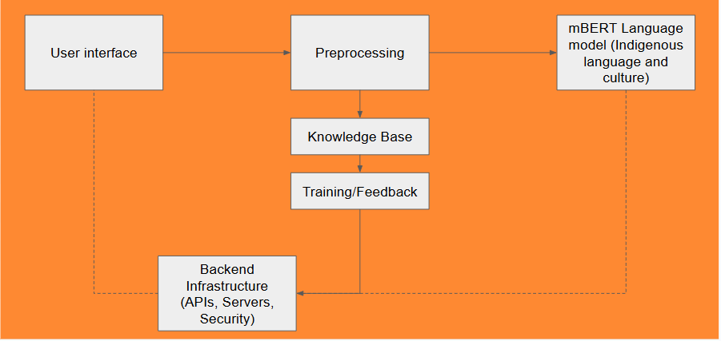

# TurtleTalk

## Introduction

Since 2008, Canada has been working toward reconciliation with Indigenous peoples, beginning with the establishment of the Truth and Reconciliation Commission (TRC). A key aspect of this effort includes the preservation of Indigenous languages and cultures (Call to Action 14) and historical records (Calls to Action 67–83). To support this, various websites have been created, including government platforms such as Indigenous Services Canada, the National Centre for Truth and Reconciliation (NCTR), and Statistics Canada, as well as Indigenous-led initiatives like the First Nations Information Governance Centre (FNIGC), FirstVoices, the Métis Nation of Canada, and Inuit Tapiriit Kanatami (ITK). While much of this data is publicly available, information is often fragmented across multiple sites, making it difficult to locate specific details on Indigenous topics. 

We are developing **TurtleTalk**, an open-source AI model, to be led by Indigenous groups, trained on Indigenous languages, cultures, and traditions. This model will serve as both a centralized repository for Indigenous knowledge—often scattered across multiple sources—and a user-friendly tool for answering questions on Indigenous topics.

With TurtleTalk, we hope to make it easier to access and retrieve information on Indigenous issues, helping to advance reconciliation through artificial intelligence. By bridging the gap between technology and tradition, TurtleTalk aims to support both Indigenous communities and non-Indigenous users in walking toward a shared future with AI hand in hand.

## Methodology

TurtleTalk is built by fine-tuning mBERT on a curated dataset of Indigenous languages, cultures, and traditions. **mBERT** was chosen for its multilingual capabilities and proven effectiveness in fine-tuning for low-resource languages, making it well-suited for Indigenous language processing.

The model is developed using the **Hugging Face Transformers** library for loading, initializing, and training mBERT. The **PyTorch** library is used for dataset handling, sentence tokenization, fine-tuning, and making predictions on input text. This framework ensures scalability, allowing for future expansion with more Indigenous languages and dialects.

The dataset is sourced from publicly available resources, including:
+ The Canadian Encyclopedia
+ Statistics Canada
+ FirstVoices
+ Indigenous Services Canada
+ First Nations Information Governance Centre (FNIGC)
To enhance coverage and accuracy, additional data can be integrated from sources such as:
+ Native Land Digital
+ The National Centre for Truth and Reconciliation (NCTR)
+ The Assembly of First Nations (AFN)
While the dataset currently has a bias towards First Nations, it can incorporate resources from the Métis Nation of Canada and Inuit Tapiriit Kanatami (ITK) to ensure broader Indigenous representation. Across all these datasets, some of this data is publicly accessible, while other portions may require permission for use.

Ensuring ethical AI use is a core priority. TurtleTalk is designed to be led by Indigenous groups,granting communities agency over data use and interpretation. Privacy considerations are carefully managed by sourcing publicly available data and respecting access restrictions. Efforts are made to mitigate biases in Indigenous language processing by incorporating diverse sources and perspectives.

By centralizing Indigenous knowledge in a structured and accessible AI model, TurtleTalk addresses the challenge of fragmented information while prioritizing scalability, security, and ethical AI development.